# Linux Task 03 – Process Management, System Monitoring & Basic Shell Scripting

## Name

Stephen J

## Date

June 2026

---

# Objective

The purpose of this task is to understand Linux process management, system monitoring, service monitoring, and basic shell scripting using Ubuntu Linux.

---

# Part A – Process Monitoring

## Commands Executed

```bash
ps
ps aux
top
htop
```

## Observations

* Learned how to view running processes.
* Identified Process IDs (PIDs).
* Monitored CPU and memory usage.
* Observed active system processes.

## Screenshots

### Screenshot 01 – ps, ps aux, top, htop Command Output

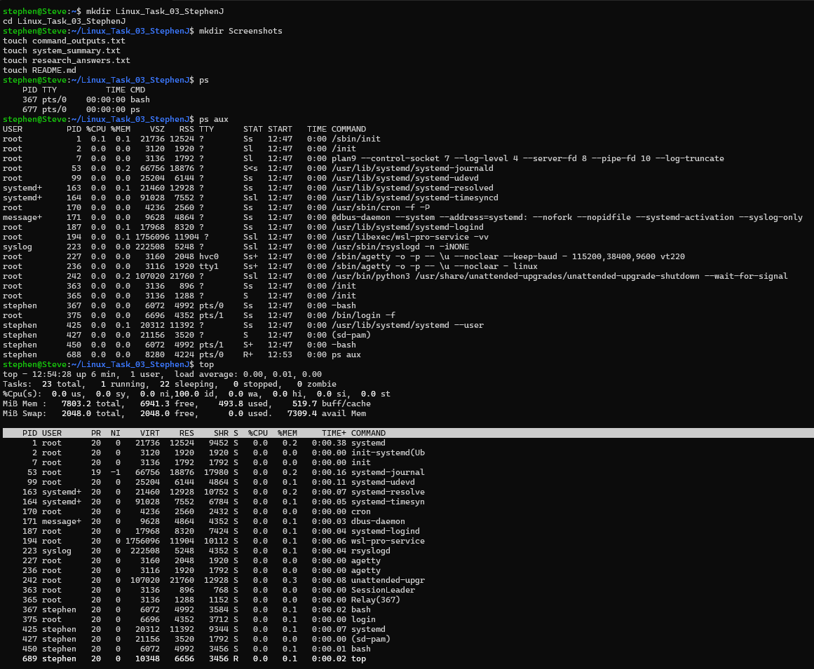


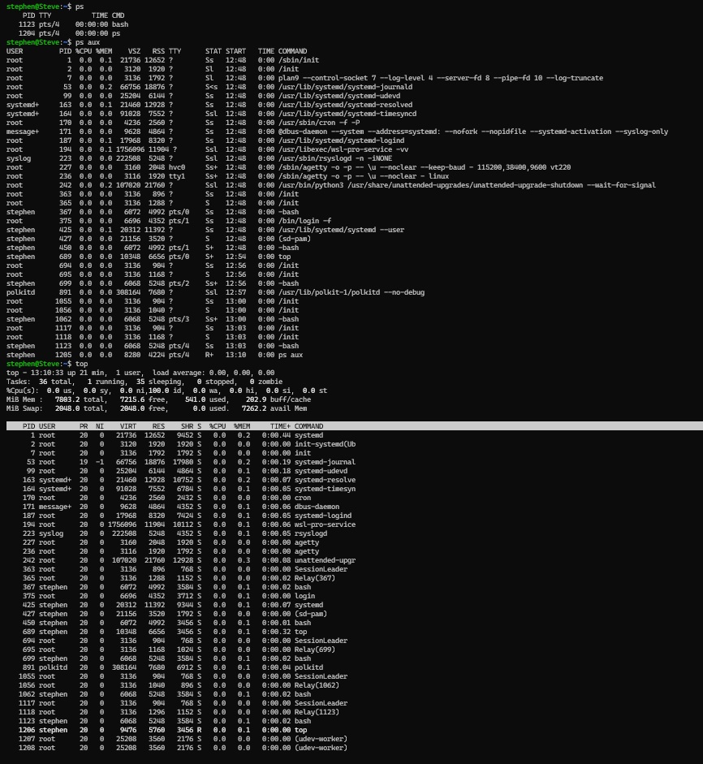


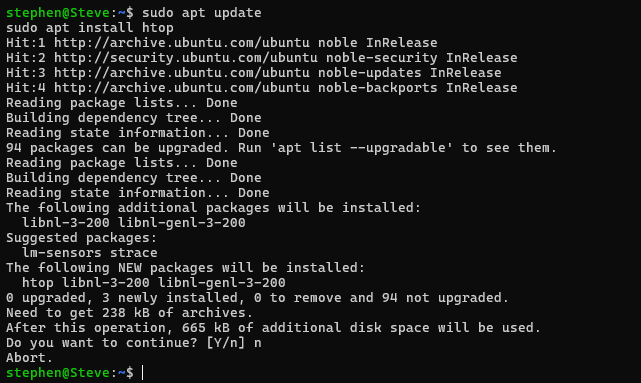

---

# Part B – Process Management

## Commands Executed

```bash
sleep 300
ps aux | grep sleep
kill PID
kill -9 PID
```

## Activities Performed

* Created a temporary process using sleep.
* Located the process PID.
* Terminated the process using kill.
* Forcefully terminated the process using kill -9.

## Screenshots

### Screenshot 05 – Running Sleep Process

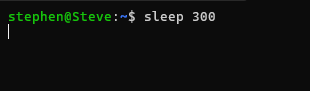

### Screenshot 06 – Finding PID, Kill Process


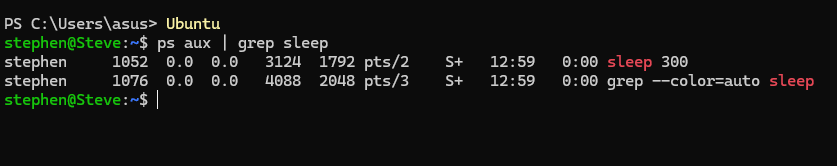


### Screenshot 08 – Force Kill Process

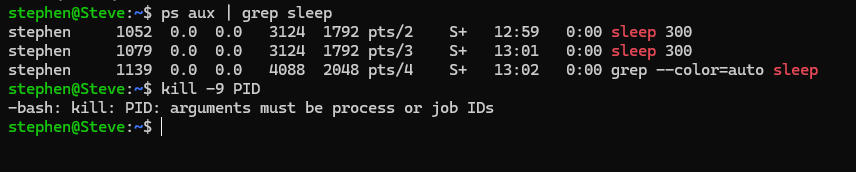

---

# Part C – System Monitoring

## Commands Executed

```bash
free -h
df -h
uptime
uname -a
```

## Information Collected

* Total RAM
* Available RAM
* Disk Usage
* System Uptime
* Kernel Version

## Files Included

* command_outputs.txt
* system_summary.txt

## Screenshots

### Screenshot 09 – free -h, df -h, uptime, uname -a

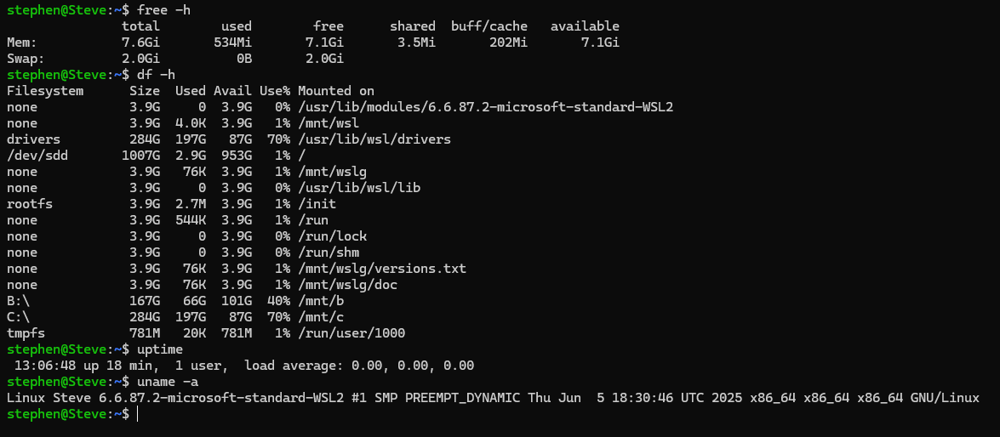


---

# Part D – Service Monitoring

## Commands Executed

```bash
systemctl status ssh
systemctl status NetworkManager
```

## Observations

* Verified service status.
* Checked whether services were active and running.
* Learned the importance of background services.

## Screenshots

### Screenshot 13 – SSH Service Status

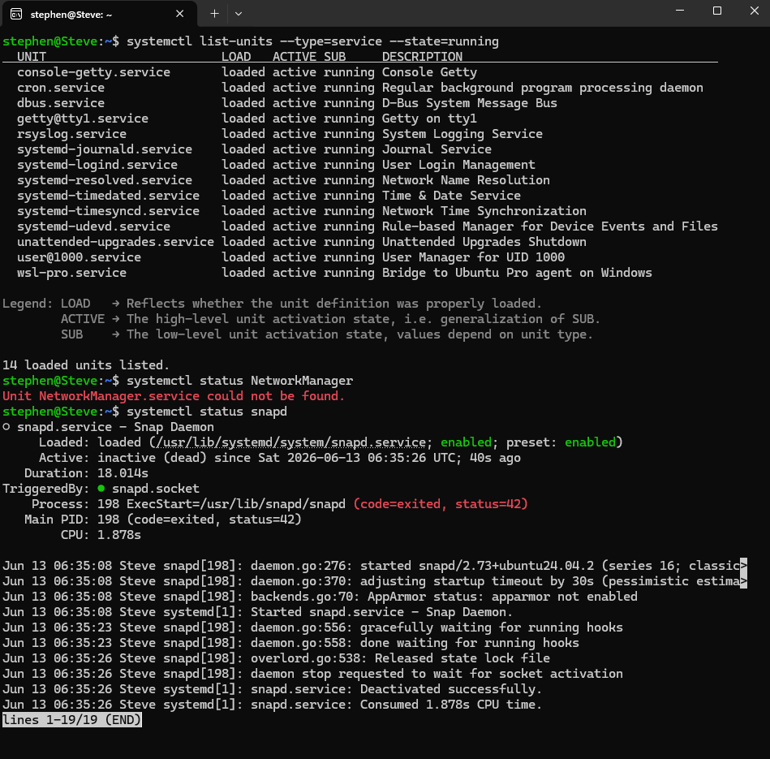

### Screenshot 14 – NetworkManager Service Status

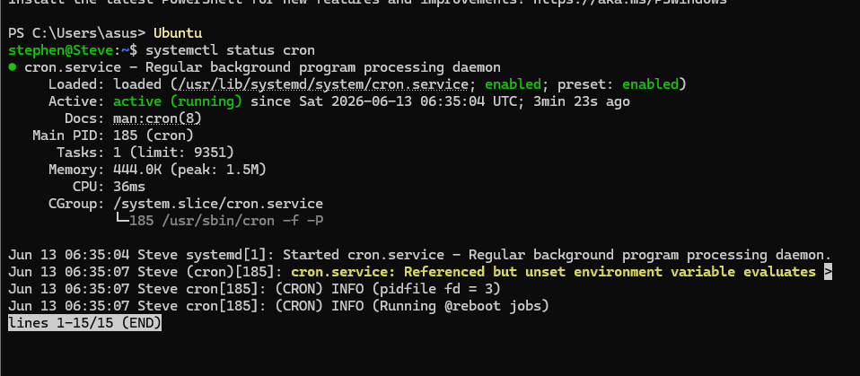

---

# Part E – Shell Scripting

## Script Created

File:

```bash
system_report.sh
```

## Commands Executed

```bash
chmod +x system_report.sh
./system_report.sh
```

## Purpose

The script displays:

* Current User
* Hostname
* Date & Time
* Current Directory
* Memory Usage
* Disk Usage
* System Uptime
* Kernel Version

## Screenshots

### Screenshot 15 – Script Execution Output

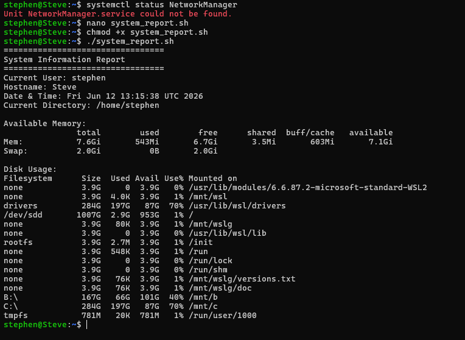

---

# Part F – Security Monitoring Challenge

## Commands Researched

```bash
netstat
ss
who
w
last
```

## Files Included

* research_answers.txt

## Screenshots

### Screenshot 17 – netstat, ss, who, w, last

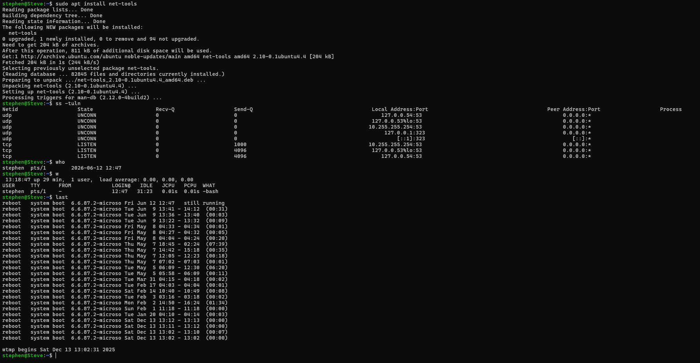

### Screenshot 18 – ss

---

# Part G – Mini SOC Activity

Topics Covered:

* Identifying resource-heavy processes.
* Detecting suspicious processes.
* Collecting information before terminating a process.
* Understanding process behavior and system performance.

Research answers are included in:

```text
research_answers.txt
```

---

# Files Included

```text
Linux_Task_03_StephenJ/

├── Screenshots/
├── system_report.sh
├── command_outputs.txt
├── system_summary.txt
├── research_answers.txt
└── README.md
```

---

# Conclusion

This task provided practical experience with Linux process monitoring, process management, service monitoring, system monitoring, shell scripting, and security monitoring techniques. These skills are essential for Linux Administration, System Monitoring, and Cyber Security operations.
